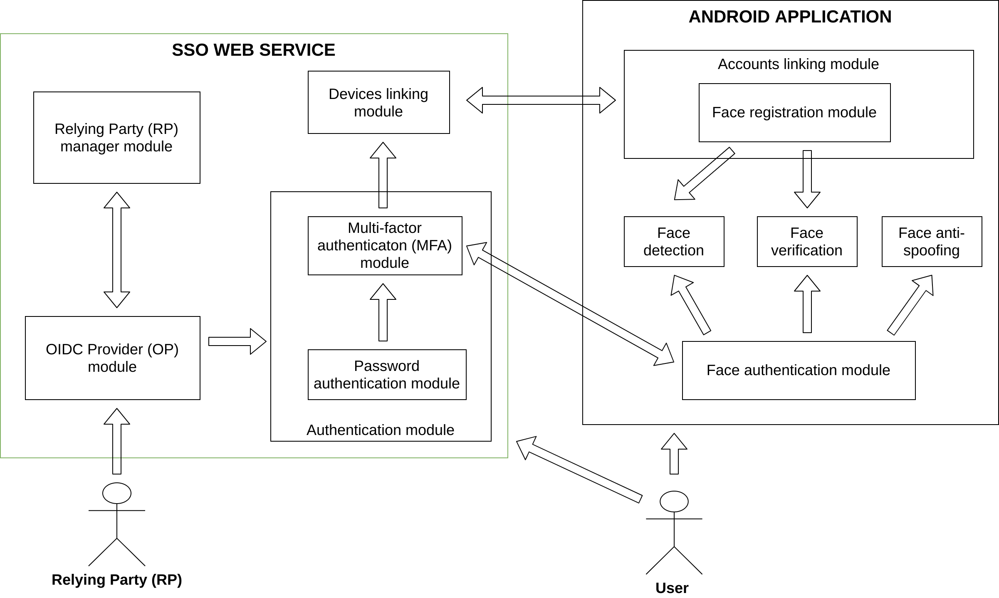
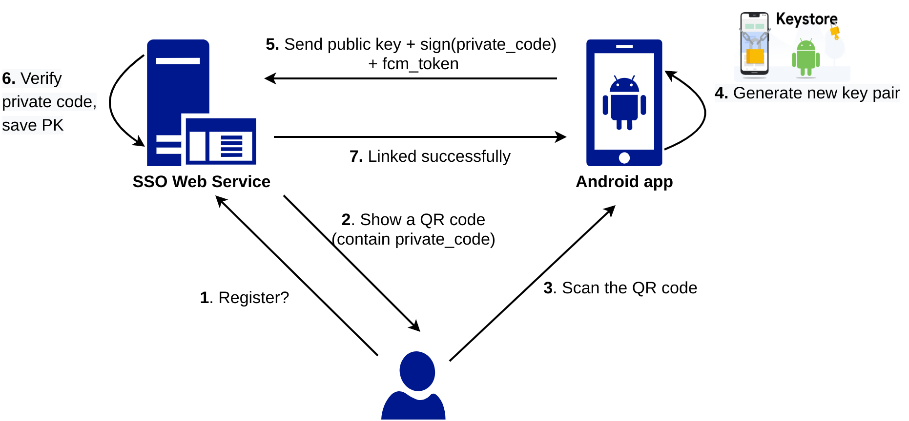
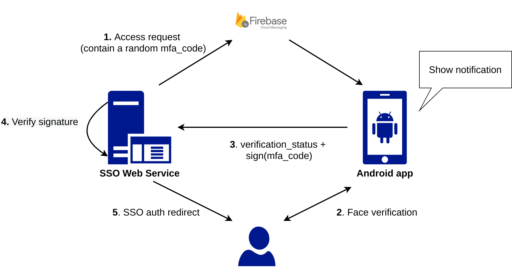

# Flask Open ID Connect (OIDC) Provider combined with Facial Two-Factors Authentication (2FA)

[oidc_provider_with_facial_mfa]: https://github.com/dangnh0611/oidc_provider_with_facial_mfa
[facial_verification_android]: https://github.com/dangnh0611/facial_verification_android
[MobileFaceNet_TF]: https://github.com/dangnh0611/MobileFaceNet_TF

## About the project
This repository is a part of my project: **Flask Open ID Connect (OIDC) Provider combined with Facial Two-Factors Authentication (2FA)**.

It contain 3 repositories:
- [oidc_provider_with_facial_mfa][oidc_provider_with_facial_mfa]: SSO Provider Web service
- [facial_verification_android][facial_verification_android]: An Android application to support 2FA with face verification.
- [MobileFaceNet_TF][MobileFaceNet_TF]: Deep face recogniton, implement and train the MobileFaceNet model to be used on Android.
---
### What is the purposes of the whole project ?
- Build a **Single Sign On (SSO) Provider** web service that implement the OpenID Connect (OIDC) specification. This SSO Provider allows Relying Parties (RPs) to register their applications and integrate this SSO service (e.g a `Login with DOneLogin` button).
- Integrate the **Two-Factor Authentication (2FA)** mechanism for better security. This project uses facial recognition as the 2nd factor that user can enable.
- Develop an Android application for 2FA facial registration/verification with frontal camera, treats user's smart phone as a token device, interacts with SSO web service to authenticate user.
- System/protocol design & implementation must ensure high security, can prevent many known attacks. I propose an ad-hoc protocol for secure messages exchange, inspired by the [WebAuthn standard](https://webauthn.guide/).
- Typical Authentication Service: email confirmation, reset password, etc.
---
### How it work?


An user who want to enable 2FA must link at least one token device (Android smart phone) with SSO web service first.
#### Linking new token device

The flow:  
1. User choose to link a new token device on SSO web app
2. Web app show a QR code which contain a random 48-characters token called `private_code`. This `private_code` must be kept private in a short amount of time.
3. User open the [DOneLogin Android app][facial_verification_android] and use it to scan for the QR code.
4. Android app generate a new Asymmetric Cryptography key pair, protected by [Android Keystore](https://developer.android.com/training/articles/keystore) system.
5. Android app send the generated `public key`, `fcm_token` and signature on `private_code` extracted from the scanned QR to the SSO Web service.
6. SSO Web service verify the signature and `private_code`. If it matches, save user's `public key`, `fcm_token`,.. to database. The linking process is successfully and Android app also save the key information (key alias,..) for future uses.

#### Face verification on 2FA flow


The flow:  
1. Start when the SSO Web service need to verify user's facial for 2FA, such that after user has entered the correct password and be redirected. SSO Web service generates a new random 48-characters token called `mfa_code`. This code is sent to user's Android phone via Firebase Cloud Messaging (FCM) since the server has already known the device's FCM token.
2. User click on notification, or open the app to verify his/her face using smart phone's frontal camera.
3. If it matches, Android app send `verification_status` (such as True/False) and signature on `mfa_code` to the SSO Web service. The signing process is supported by Android Keystore, using the previously registerd private key.
4. The SSO Web service verify the signature using the corresponding saved public key of user's token device. If it matches, redirection is done base on the `verification_status` (e.g Valid or Invalid).

---

## About this repository
This repository is the implementation of SSO Web service.
### Technologies:
- **Backend**: Python 3, Flask, Authlib, firebase-admin, Google reCAPTCHA v2, Flask-Login, Flask-Session, Flask-SQLAlchemy, Flask-WTF, pycryptodome, PyQRCode, OpenSSL.
- **Frontend**: HTML5, CSS3, Bootstrap 3, SB Admin 2, JS, Handlebars JS.
### Features:
- [x] Basic authentication services: Signup, Signin
- [x] Account confirmation email
- [x] Reset password email
- [x] Google reCAPTCHA v2 to prevent brute force attack
- [x] Two-factor authentication (2FA)
- [x] Link/manage token devices
- [x] Allow Relying Parties (RPs) to register/manage their application
- [x] OIDC Discovery Endpoint
- [x] Example of RP application

---
## How to run
1. Config the app, generate self-signed SSL certification and RS256 key pair. Take a look at [setup.sh](./setup.sh) for more details. 
```bash
sudo chmod +x setup.sh
./setup.sh
```

2. Go and get a [Google reCAPTCHA v2](https://www.google.com/recaptcha/about/) key pair. Fill the generated `./instance/config.py` with your own config: app secret key, gmail account, reCAPTCHA key pair.

3. Go and get a [Firebase Cloud Messaging (FCM)](https://firebase.google.com/docs/cloud-messaging) credentials in JSON format, put it at `./instance`, such as `./instance/donelogin-9f53f-firebase-adminsdk-sxu56-8682d3b594.json`
4. Activate virtual environment then install requirements:
```bash
python3 -m venv env
source venv/bin/activate
pip3 install -r requirements.txt
```
5. Start OIDC Provider on port 5000:
```bash
./run_op.sh
```
6. Optionally, start Relying Party demo application (you'll need to register a new application first, get the `client_id` and `client_secret`, then fill it on [relying_party/config.py](./relying_party/config.py)), e.g on port 3000:
```bash
./run_rp.sh 3000
```